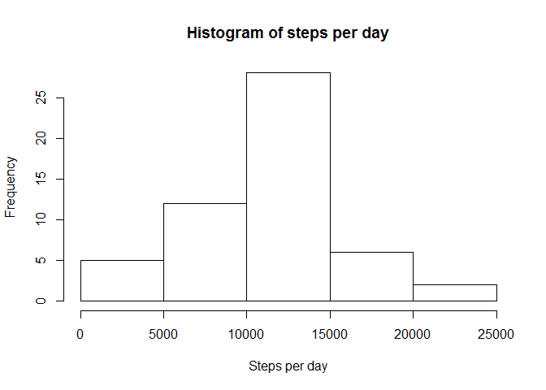

# Reproducible Research: Peer Assessment 1


## Loading and preprocessing the data

### Load the data


```r
temp <- unz("activity.zip", "activity.csv")
data <- read.csv(temp)
hours <- substr(sprintf("%04d",data$interval), 0, 2)
minutes <- substr(sprintf("%04d",data$interval), 3, 4)
data$time_str <- paste(hours, minutes, sep = ":")
data$time <- as.POSIXct(data$time_str, format="%H:%M")
```


### Process intervals into hour labels and time for further use in charts


```r
hours <- substr(sprintf("%04d",data$interval), 0, 2)
minutes <- substr(sprintf("%04d",data$interval), 3, 4)
data$time_str <- paste(hours, minutes, sep = ":")
data$time <- as.POSIXct(data$time_str, format="%H:%M")
```


## What is mean total number of steps taken per day?

### Make a histogram of the total number of steps taken each day


```r
total.steps.day <- aggregate(steps~date, data, sum)
hist(total.steps.day$steps, main = "Histogram of steps per day", xlab = "Steps per day")
```




### Calculate and report the mean and median total number of steps taken per day


```r
mean.total.steps.day <- mean(total.steps.day$steps)
median.total.steps.day <- median(total.steps.day$steps)
```

For total number of steps taken per day, mean = 10766.19, median = 10765.00


## What is the average daily activity pattern?

### Make a time series plot (i.e. type = "l") of the 5-minute interval (x-axis) and the average number of steps taken, averaged across all days (y-axis)


```r
mean.steps.interval <- aggregate(steps~interval+time+time_str, data, mean)
plot(mean.steps.interval$time, mean.steps.interval$steps, type="l", 
     main = "Average steps by day time", ylab="Number of steps", xlab = "Day time", xaxt="n")
max.steps <- max(mean.steps.interval$steps)
max.steps.intervals.df <- mean.steps.interval[mean.steps.interval$steps == max.steps, ]
max.steps.intervals.arr <- max.steps.intervals.df$time
for (t in 1:length(max.steps.intervals.arr)) {
    abline(v = max.steps.intervals.arr[t], col = "red", lwd = 1)   
}
cnt <- length(mean.steps.interval$time)
tm <- mean.steps.interval$time[seq(1,cnt, 36)]
tm <- union(tm, max.steps.intervals.arr)
tm <- tm[order(tm)]
lb <- mean.steps.interval[mean.steps.interval$time %in% tm,]$time_str
axis(labels = lb, side=1, at = tm)
legend(x = "topright", c("Maximum avg steps"), col = c("red"), lwd = c(1))
```


### Which 5-minute interval, on average across all the days in the dataset, contains the maximum number of steps?

5-minute intervals, on average across all the days in the dataset, which contains the maximum number of steps: 


time        steps
------  ---------
08:35    206.1698


## Imputing missing values

### Calculate and report the total number of missing values in the dataset


```r
na.total <- sum(is.na(data))
```

Total number of missing values in the dataset: 2304


### Devise a strategy for filling in all of the missing values in the dataset

Let's combine both proposed strategies by calculating average of day mean and interval mean for each day interval


```r
data.m <- data
data.m$steps.m.d <- with(data.m, ave(steps, date, FUN = function(x) mean(na.omit(x))))
steps.m.d.na <- is.na(data.m$steps.m.d)
if(sum(steps.m.d.na) > 0){
    data.m[steps.m.d.na,]$steps.m.d <- 0
}
data.m$steps.m.i <- with(data.m, ave(steps, interval, FUN = function(x) mean(na.omit(x))))
steps.m.i.na <- is.na(data.m$steps.m.i)
if(sum(steps.m.i.na) > 0){
    data.m[steps.m.i.na,]$steps.m.i <- 0
}
data.m$steps.m <- rowMeans(data.m[,c("steps.m.d", "steps.m.i")])
```


### Create a new dataset that is equal to the original dataset but with the missing data filled in


```r
data.c <- data
na.indexes <- which(is.na(data$steps))
data.c[na.indexes,]$steps <- data.m[na.indexes,]$steps.m
```


### Make a histogram of the total number of steps taken each day


```r
total.steps.day.c <- aggregate(steps~date, data.c, sum)
hist(total.steps.day.c$steps, main = "Histogram of steps per day with imputed NA", xlab = "Steps per day")
```


### Calculate and report the mean and median total number of steps taken per day


```r
mean.total.steps.day.c <- mean(total.steps.day.c$steps)
median.total.steps.day.c <- median(total.steps.day.c$steps)
```

For total number of steps taken per day of data with imputed NA values, mean = 10060.21, median = 10395.00.


### Do these values differ from the estimates from the first part of the assignment?

Difference with appropriate values in original data, mean diff = -705.98, median diff = -370.00.


## Are there differences in activity patterns between weekdays and weekends?

### Create a new factor variable in the dataset with two levels -- "weekday" and "weekend" indicating whether a given date is a weekday or weekend day.


```r
data.c$date.date <- as.Date(data.c$date)
week.day.names <- c('Monday', 'Tuesday', 'Wednesday', 'Thursday', 'Friday')
wd.factor.labels <- c('weekend', 'weekday')
wd.factor.values <- (weekdays(data.c$date.date) %in% week.day.names)
data.c$wd <- factor(wd.factor.values, levels=c(FALSE, TRUE), labels=wd.factor.labels)
```


### Make a panel plot containing a time series plot (i.e. type = "l") of the 5-minute interval (x-axis) and the average number of steps taken, averaged across all weekday days or weekend days (y-axis).


```r
mean.steps.interval.wd <- aggregate(steps~interval+wd+time+time_str, data.c, mean)
mean.steps.interval.wd.week <- mean.steps.interval.wd[mean.steps.interval.wd$wd == 'weekday',]
mean.steps.interval.wd.end <- mean.steps.interval.wd[mean.steps.interval.wd$wd == "weekend",]
tm <- mean.steps.interval$time[seq(1,cnt, 36)]
lb <- mean.steps.interval[mean.steps.interval$time %in% tm,]$time_str
par(mfrow=c(2, 1), oma = c(5,5,5,5),  mar = c(0,0,0,0))
max.steps.week <- max(mean.steps.interval.wd.week$steps)
ylim.week <- max.steps.week*1.1
plot(mean.steps.interval.wd.week$time, mean.steps.interval.wd.week$steps, 
     type="l", xaxt="n",  yaxt="n", ylim = c(0, ylim.week))
axis(side=2, labels = F)
axis(side=3, at = tm, labels = F)
axis(side=4)
mtext("weekday", line = -1, side=3)
max.steps.end <- max(mean.steps.interval.wd.end$steps)
ylim.end <- max.steps.end*1.1
plot(mean.steps.interval.wd.end$time, mean.steps.interval.wd.end$steps, 
     type="l", xaxt="n", yaxt="n", ylim = c(0, ylim.end))
axis(side=2)
axis(side=4, labels = F)
axis(labels = lb, side=1, at = tm)
mtext("weekend", line = -1, side=3)
mtext("Day time", line = 3, side=1 , outer = T)
mtext("Number of steps", line = 3, side=2 , outer = T)
mtext("Average steps by day time during weekday/weekend", line = 2, side=3 , outer = T, cex = 1.5)
```


